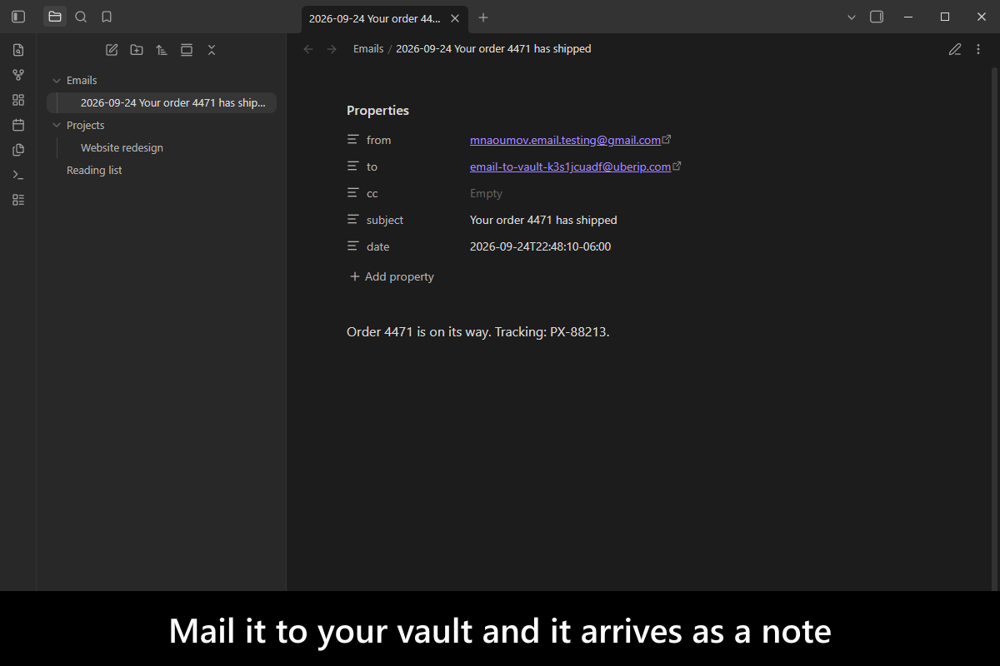
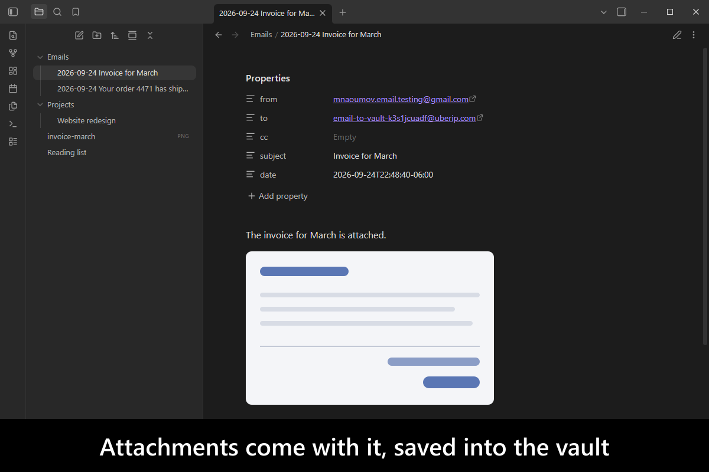
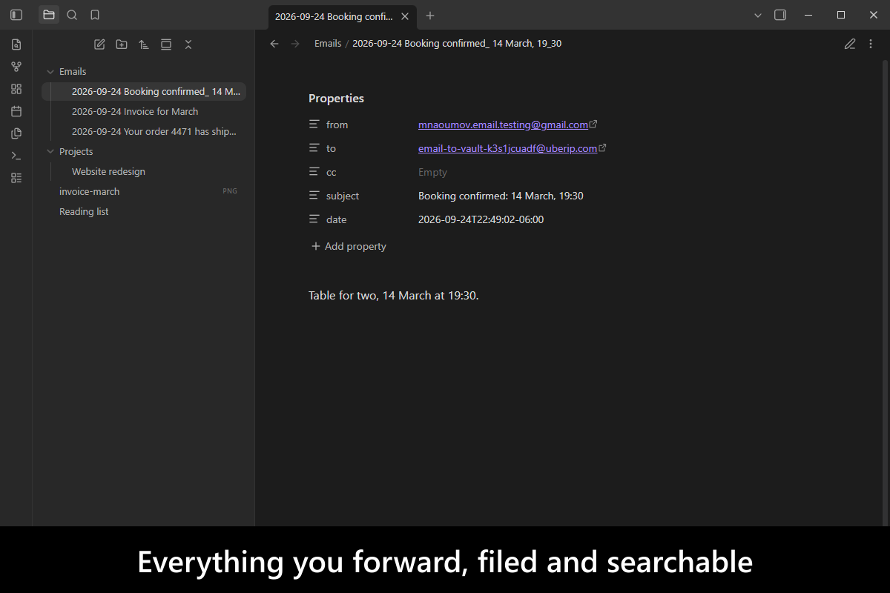
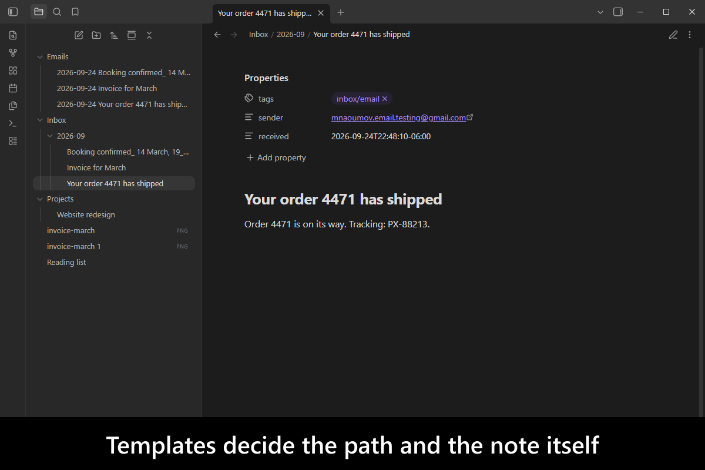
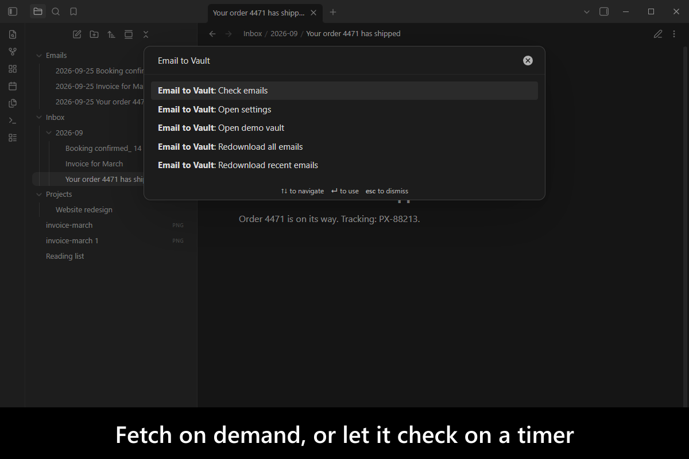
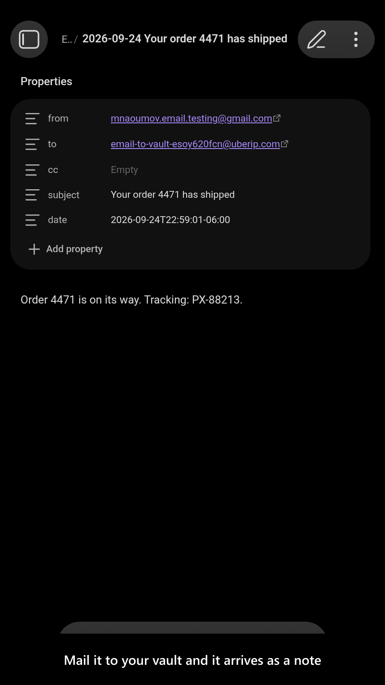
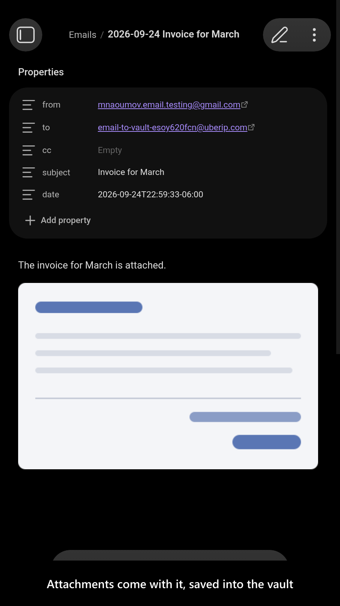
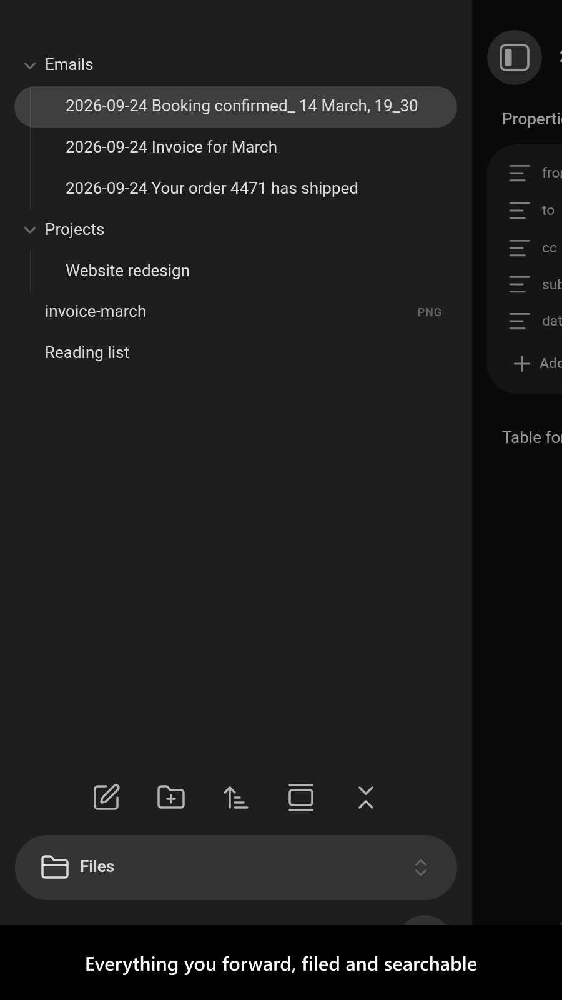
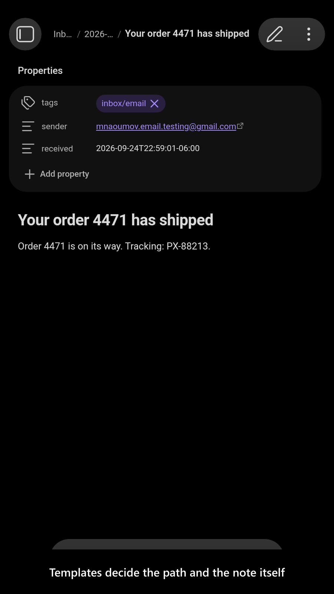
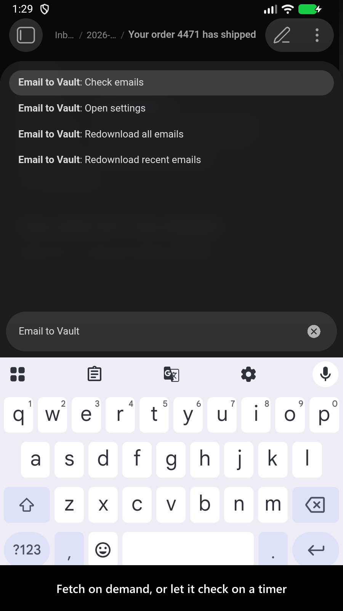

# Email to Vault

[](https://www.buymeacoffee.com/mnaoumov) [](https://github.com/mnaoumov/obsidian-email-to-vault/releases) [](https://github.com/mnaoumov/obsidian-email-to-vault/releases) [](https://github.com/mnaoumov/obsidian-email-to-vault)

Things worth keeping arrive by email — a receipt, a confirmation, a thread you want to think about — and getting them into [Obsidian](https://obsidian.md/) means copying, pasting and re-saving the attachments by hand. This plugin makes an email address the way into your vault: send or forward mail to it and each message becomes a note, with From, To, CC, Subject, Body and attachments preserved.

Use the built-in disposable mailbox (Mail.tm) for a one-click address that needs no account, or connect your own IMAP server — Gmail, Outlook, self-hosted — and keep everything on infrastructure you already trust. No backend and no paid service either way. Inspired by [`Save emails into Evernote`](<https://help.evernote.com/hc/en-us/articles/209005347-Save-emails-into-Evernote>).

<!-- markdownlint-disable MD033 -->

<a href="https://github.com/mnaoumov/obsidian-email-to-vault/blob/HEAD/images/screenshots/screenshot-desktop-1.png"></a>

<details>
<summary>More screenshots</summary>

<div>
<a href="https://github.com/mnaoumov/obsidian-email-to-vault/blob/HEAD/images/screenshots/screenshot-desktop-2.png"></a>
<a href="https://github.com/mnaoumov/obsidian-email-to-vault/blob/HEAD/images/screenshots/screenshot-desktop-3.png"></a>
<a href="https://github.com/mnaoumov/obsidian-email-to-vault/blob/HEAD/images/screenshots/screenshot-desktop-4.png"></a>
<a href="https://github.com/mnaoumov/obsidian-email-to-vault/blob/HEAD/images/screenshots/screenshot-desktop-5.png"></a>
<a href="https://github.com/mnaoumov/obsidian-email-to-vault/blob/HEAD/images/screenshots/screenshot-mobile-1.png"></a>
<a href="https://github.com/mnaoumov/obsidian-email-to-vault/blob/HEAD/images/screenshots/screenshot-mobile-2.png"></a>
<a href="https://github.com/mnaoumov/obsidian-email-to-vault/blob/HEAD/images/screenshots/screenshot-mobile-3.png"></a>
<a href="https://github.com/mnaoumov/obsidian-email-to-vault/blob/HEAD/images/screenshots/screenshot-mobile-4.png"></a>
<a href="https://github.com/mnaoumov/obsidian-email-to-vault/blob/HEAD/images/screenshots/screenshot-mobile-5.png"></a>
</div>

</details>

<!-- markdownlint-enable MD033 -->

## Demo vault

**The documentation is a demo vault.** Every feature has a note explaining what it does and why you would want it, and walking you through it.

**[Start reading here](<./demo-vault/00 Start.md>)** — it is plain markdown, so it works on GitHub with nothing installed.

A copy of the vault ships with every release. You can access it via any of the following:

1. Running the **Email to Vault: Open demo vault** command.
2. Downloading `email-to-vault-demo-vault-<version>.zip` (`<version>` is the release version) from the [Releases](https://github.com/mnaoumov/obsidian-email-to-vault/releases).
3. Browsing its source in [`demo-vault/`](./demo-vault/README.md) in this repository.

> [!NOTE]
>
> Unlike most demo vaults, this one cannot pre-bake its feature: it fetches real mail from a live service over the network. The notes walk you through configuring **your own** inbox instead.

## What it does

- **Two email modes** — a disposable Mail.tm mailbox created in one click, or your own IMAP server. IMAP is desktop only; Mail.tm works everywhere. [01 Create a mailbox](<./demo-vault/01 Create a mailbox.md>) · [02 IMAP mode](<./demo-vault/02 IMAP mode.md>)
- **Automatic sync** — the plugin checks for new mail periodically and saves each message as a note, with full metadata and attachments. [03 Email notes and commands](<./demo-vault/03 Email notes and commands.md>)
- **Notes shaped the way you want** — path and body come from templates, so an email can land anywhere under any name with whatever frontmatter you choose. [04 Settings](<./demo-vault/04 Settings.md>)
- **Preserve read state** — optionally leave messages untouched on the server, so they stay unread in your other email clients while still being archived here. [04 Settings](<./demo-vault/04 Settings.md>)
- **Know where your mail goes.** Mail.tm routes messages through a third party; IMAP does not. The difference is spelled out rather than buried. [05 Privacy and data handling](<./demo-vault/05 Privacy and data handling.md>)

> [!WARNING]
>
> In Mail.tm mode, emails are routed through the third-party service [mail.tm](https://mail.tm/) and retained there for up to 7 days. **Do not send sensitive information — use at your own risk.** See [05 Privacy and data handling](<./demo-vault/05 Privacy and data handling.md>).

## Installation

The plugin is available in [the official Community Plugins repository](https://community.obsidian.md/plugins/email-to-vault).

### Beta versions

To install the latest beta release of this plugin (regardless if it is available in [the official Community Plugins repository](https://community.obsidian.md) or not), follow these steps:

1. Ensure you have the [BRAT plugin](https://community.obsidian.md/plugins/obsidian42-brat) installed and enabled.
2. Click [Install via BRAT](https://intradeus.github.io/http-protocol-redirector?r=obsidian://brat?plugin=https://github.com/mnaoumov/obsidian-email-to-vault).
3. An Obsidian pop-up window should appear. In the window, click the `Add plugin` button once and wait a few seconds for the plugin to install.

## Debugging

By default, debug messages for this plugin are hidden.

To show them, run the following command in the `DevTools Console`:

```js
window.DEBUG.enable('email-to-vault');
```

For more details, refer to the [documentation](https://mnaoumov.dev/obsidian-dev-utils/guides/debugging/).

## Changelog

All notable changes to this project will be documented in the [CHANGELOG](./CHANGELOG.md).

## Contributing

Contributions are welcome — see [CONTRIBUTING](./CONTRIBUTING.md) to get set up.

## Support

<!-- markdownlint-disable MD033 -->

<a href="https://www.buymeacoffee.com/mnaoumov" target="_blank"></a>

<!-- markdownlint-enable MD033 -->

## My other Obsidian resources

[See my other Obsidian resources](https://github.com/mnaoumov/obsidian-resources).

## License

© [Michael Naumov](https://github.com/mnaoumov/)
